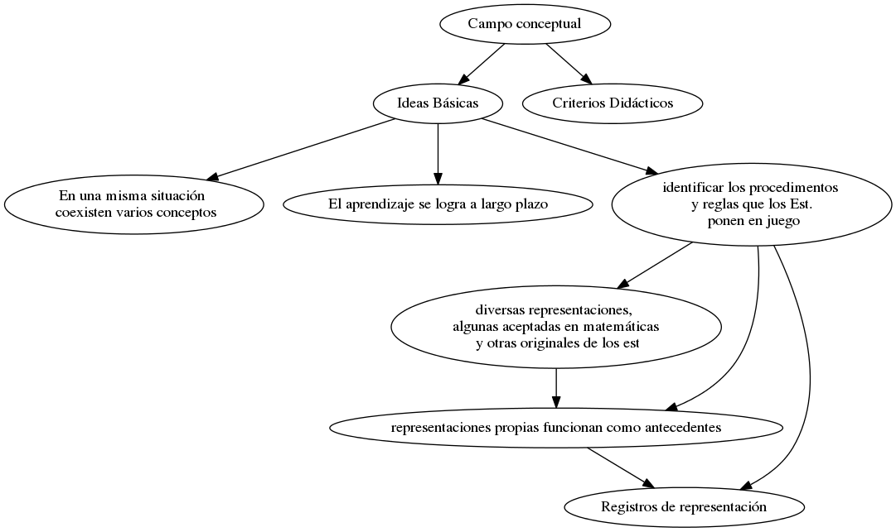
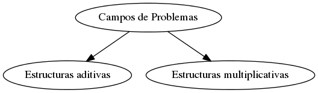

<h2>Table of Contents</h2>

<ul>
<li><a href="#sec-1">1. Perspectivas para la Enseñanza de la Matemática - Primaria</a>
<ul>
<li><a href="#sec-1-1">1.1. Clase 1: Contextos y problemas</a>
<ul>
<li><a href="#sec-1-1-1">1.1.1. TODO Tarea</a></li>
</ul>
</li>
<li><a href="#sec-1-2">1.2. Clase 2: Nuestras tradiciones de enseñanza</a>
<ul>
<li><a href="#sec-1-2-1">1.2.1. ¿Cuánto de deliberado y cuánto de espontáneo tienen nuestros modelos de enseñanza?</a></li>
<li><a href="#sec-1-2-2">1.2.2. Las marcas de los clásicos</a></li>
<li><a href="#sec-1-2-3">1.2.3. ¿Y qué efectos producen estas prácticas en la percepción que tienen los alumnos de la matemática?</a></li>
<li><a href="#sec-1-2-4">1.2.4. Las marcas de los modernos</a></li>
<li><a href="#sec-1-2-5">1.2.5. La presencia de los materiales didácticos en las aulas&#x2026;</a></li>
<li><a href="#sec-1-2-6">1.2.6. ¿Qué perspectivas surgieron después de las reacciones a la matemática moderna en las aulas?</a></li>
<li><a href="#sec-1-2-7">1.2.7. Actividad: Para pensar, registrar y guardar&#x2026;</a></li>
</ul>
</li>
<li><a href="#sec-1-3">1.3. Clase 3: Los alumnos y las formas de apropiación de los contenidos matemáticos</a>
<ul>
<li><a href="#sec-1-3-1">1.3.1. Gráficos</a></li>
<li><a href="#sec-1-3-2">1.3.2. Discusiones en clase</a></li>
<li><a href="#sec-1-3-3">1.3.3. Actividad 3:</a></li>
</ul>
</li>
<li><a href="#sec-1-4">1.4. Clase 4: La clase, los problemas y su gestión</a>
<ul>
<li><a href="#sec-1-4-1">1.4.1. Los problemas en la clase, las situaciones</a></li>
<li><a href="#sec-1-4-2">1.4.2. El avance de la clase y su gestión</a></li>
<li><a href="#sec-1-4-3">1.4.3. Actividad:</a></li>
</ul>
</li>
<li><a href="#sec-1-5">1.5. Clase 5.1: La escuela y las decisiones institucionales.</a>
<ul>
<li><a href="#sec-1-5-1">1.5.1. ¿Qué saberes enseñar?</a></li>
<li><a href="#sec-1-5-2">1.5.2. ¿Qué efectos tienen las transformaciones de saberes en la enseñanza?</a></li>
<li><a href="#sec-1-5-3">1.5.3. ¿Qué tipo de trabajo matemático en el aula?</a></li>
<li><a href="#sec-1-5-4">1.5.4. ¿Qué prácticas en cada institución?</a></li>
<li><a href="#sec-1-5-5">1.5.5. La actividad matemática como asunto de la enseñanza</a></li>
<li><a href="#sec-1-5-6">1.5.6. Actividad Clase 5</a></li>
</ul>
</li>
<li><a href="#sec-1-6">1.6. Clase 6: Los conocimientos teóricos y las decisiones en la práctica</a>
<ul>
<li><a href="#sec-1-6-1">1.6.1. Nociones didácticas y decisiones de enseñanza</a></li>
<li><a href="#sec-1-6-2">1.6.2. Acerca de las representaciones de los objetos matemáticos</a></li>
<li><a href="#sec-1-6-3">1.6.3. Proyecto de enseñanza y modelo didáctico</a></li>
</ul>
</li>
<li><a href="#sec-1-7">1.7. Notas</a></li>
<li><a href="#sec-1-8">1.8. Bibliografía</a></li>
</ul>
</li>
</ul>

# Perspectivas para la Enseñanza de la Matemática - Primaria

## Clase 1: Contextos y problemas

### TODO Tarea

-   Elegir una imagen entre las que no se abordaron en el desarrollo de esta clase que remita a un contexto intramatemático o uno extramatemático.
-   Realizar un breve análisis considerando:
    -   En el caso extramatemático: si ¿la situación resulta verosímil? ¿el contexto permite evaluar la razonabilidad de la respuesta obtenida? ¿Por  qué?
    -   En el caso intramatemático: ¿cuál es el conocimiento matemático en estudio? ¿A qué conclusiones piensa que se quiere llegar?

## Clase 2: Nuestras tradiciones de enseñanza

### ¿Cuánto de deliberado y cuánto de espontáneo tienen nuestros modelos de enseñanza?

:: Modelo epistemológico: manera particular de interpretar las matemáticas
::  Modelo Didáctico: Una conceptualización concreta de lo que se entiende por 'enseñar y aprender' en un momento histórico, en cada tradición cultural y en cada institución.

::  Modelos didácticos espontaneso: No presentan ningún tipo de justificación explícita, mas allá de criterios genéricos emanados del sentido común.

:: Modelos didácticos deliberados: Se plantean a base de criterios manifiestos y potencialmente criticables, con principios que los fundamentan y explicitan.
-   Decisiones de enseñanza sujetas a proyectos educativos, reguladas por el proyecto social-político de enseñanza de las jurisdicciones
-   Los avances didácticos responde a conocimientos que surgen en distintos momentos.
-   Cada aporte tiene un cierto valor, pero ese valor no es absoluto, sino relativo a un proyecto y a condiciones de enseñanza. Y los proyectos y las condiciones cambian.

### Las marcas de los clásicos

-   Actividades centradas en la aplicación de técnicas:
    -   resolución de tareas aisladas,
    -   sin toma de decisiones
    -   sin necesidad de controlar el resultados de lo que se hace o
    -   sin justificar la técnica que utiliza.
-   la enseñanza de las operaciones se centraba en el trabajo sobre los algoritmos, naturalizando su aplicación posterior a la resolución de problemas.
-   Reducción de un contenido matemático a sus supuestas formas elementales, referidas a situaciones del mundo real, o más bien, el *mundo escolar*
-   En el caso de la **geometría**:
    -   Presentación iniciada por el punto, recta, plano. Para luego pasar a ángulos, figuras planas y sus medidas; los cuerpos y las medidas
    -   Sugerencias relacionadas con el trabajo manual para "Hacer concreto lo abstracto"
    -   Criterio " De lo fácil a lo difícil" respetando la estructura axiomática
    -   Comprender los conocimientos matemáticos a partir de una explicación y la representación de algunos ejemplos, le exige "saltar" el proceso de construcción progresiva que a la comunidad matemática le llevó siglos.
    -   Comprender los resultados sin haber realizado el proceso y sin saber versiones intermedias de ese conocimiento que se presenta acabado y perfecto.

### ¿Y qué efectos producen estas prácticas en la percepción que tienen los alumnos de la matemática?

-   Se induce al alumnos a pensar que la matemática es:
    -   general,
    -   abstracta
    -   difícil por naturaleza,
    -   y sin vinculación con los sujetos.

### Las marcas de los modernos

-   Fueron dos loas vías por las que se buscó cambiar la forma de enseñanza de la matemática en la escuela:
    -   Nuevos contenidos
    -   Aprendizaje por descubrimiento
-   ¿Cuál era el sentido de cambiar modelos concretos por ideas abstractas?
    -   Se buscaba que a través de la noción de conjunto, y sus operaciones, el niño desarrollara su capacidad para establecer relaciones y pudiera resolver distintas situaciones..
    -   En nivel inicial se propuso trabajar con clasificaciones y seriaciones antes de pasar a la idea de número
    -   El estudio de conjuntos resulta valioso por:
        -   pone en evidencia los fundamentos lógicos de la matemática
        -   promueve el enlace en espiral de los elementos de la matemática y facilita la visualización de las relaciones para el planteamiento de nuevos problemas.
        -   Se proyecta a todas las materias y a todos los ámbitos.

### La presencia de los materiales didácticos en las aulas&#x2026;

-   Con el propósito de ir de lo concreto a lo abstracto, de la manipulación a la representación, surgieron las *varillas* y los *geoplanos*.
-   También surgieron materiales para apoyar el sistema de numeración y el cálculo, como el *material multibase* o el uso de *regletas*
-   Se produce un corrimiento al objeto ya que lo que se enseña y aprende es a usar el material y -de no mediar otras acciones- los alumnos no pueden resolver sin él.

### ¿Qué perspectivas surgieron después de las reacciones a la matemática moderna en las aulas?

### Actividad: Para pensar, registrar y guardar&#x2026;

-   Registren sus primeras impresiones sobre las marcas de los clásicos y los modernos en su propia historia escolar y profesional. Guarden estas notas, podrán ser de mucha utilidad en el momento de elaboración del trabajo final. Estas notas no deben enviarlas al tutor, es un insumo personal de trabajo.

En mi caso no es tanto la marca personal de los clásicos o modernos lo que me suscita la clase, sino la ruptura que viví al atravesar un cambio de escuela entre 4to grado y 5to grado. Fue una etapa dura de mi vida, en cuarto grado vivía con mi papá (separado desde los 6 años) desde hacía 2 años y se separa por segunda vez con lo que vuelvo a vivir con mi mamá. En medio de estos cambios mi rebeldía se manifestaba en la escuela, en particular con una maestra nueva (otro cambio) que si bien no era joven, presentaba nuevos modos de enseñar y yo fui muy cruel con ella. 
No puedo recordar claramente cómo enseñaba, pero si se que cuando pasé a 5to, en una nueva escuela, todo cambió. Tuve serios problemas para pasar de grado principalmente porque no podía entender el algoritmo de la división. Sabía, podía dividir, resolvía problemas, pero no entendía de donde salían los número. En esta escuela la división se abordaba de forma más mecanizada por el algoritmo y la resta producto de la multiplicación entre el cociente y el divisor la obviaban, osea, ponían el resultado directo. Esto me mareaba y no fue hasta que lo mecanicé que atravesé ese grado. 
Muchos años después, en el profesorado, en las primeras clases de matemática un deja vu o un claro momento de insight en el cual como rayo atravesando el cielo comprendí que la señorita de 4to me enseñaba usando el enfoque de didáctica de la matemática que estaba en ese preciso momento aprendiendo. Que fue ella quien se dedicó a intentar que piense las matemáticas y no que las reproduzca. Y yo lo único que recuerdo haberle devuelto fueron malos tratos, burlas e improperios. Ahora me encuentro en este lado de la vida donde intento aprender a enseñar como ella me enseñó a mi. 

## Clase 3: Los alumnos y las formas de apropiación de los contenidos matemáticos

-   Es clave entender la **forma de aprender** para pensar como orientar la enseñanza
-   Aportes teóricos sobre **la forma de aprender**:
    -   Fundamentos Piagetianos para la construcción del pensamiento conceptual:
        -   Gerard Vergnaud y la teoría de los campos conceptuales
        -   Raymond Duval
        -   Michele Artigue
        -   Colette laborde
    -   El aprendizaje por resolución de problemas:
        -   ¿A través de qué tipo de situaciones adquieren significado los conceptos y procedimientos matemáticos?
        -   ¿Cuáles serían las condiciones que deben reunir tales situaciones para propiciar la apropiación del saber por quien aprende?
        -   La actividad de aprender es una *acción en situación*.
            -   *acción en situación* como la que se desarrolla en ocasión de *resolver un problema*
            -   Base o criterio del pensamiento conceptual:
            
            :: Una práctica lograda por entrenamiento o acondicionamiento no es un concepto, pero un concepto que no sea operativo tampoco lo es. (Vergnaud 1997)
            
            -   Esto es un hacer en que se puedan dar explicaciones teóricas y unas nociones teóricas que puedan ser utilizadas cuando sea necesario.
            
            :: [estas situaciones son aquellas] para las que el sujeto no dispone de todas las competencias necesarias, lo que lo obliga a un tiempo de reflexión y de exploración, a dudas, a tentativas abortadas; y lo conduce eventualmente al triunfo, y eventualmente al fracaso” - (Vergnaud, 1991: 135-136)
            
            :: Consideramos que cada actividad constituye un problema matemático para un alumno en la medida en que involucra un enigma, un desafío a sus conocimientos matemático, es decir, si estos le permiten inicar la resolución del problema y para hacerlo, elabora un cierto procedimiento y pone en juego las nociones que tiene disponibles, modificándolas y estabñeciendo nuevas relaciones. (cuaderno para el aula 3, pag. 20, MEN, 2006)
    -   ¿Qué más sobre la resolución?
        -   Procesos interpersonales que luego devienen procesos intrapersonales
        -   Modalidades de procesos interpersonales
            -   Con o sin dimensión social del problema: Implica que haya o no una comunicación efectiva entre las partes para la resolución del problema.
        -   Las interacciones durante el debate implican, para cada niño, volver a pensar en las relaciones que estableció entre los elementos del problema y explicitarlas, reconocerlas.
    -   ¿Cómo elegimos los problemas?
        
        :: Campo Conceptual: Interconexión entre los conceptos matemáticos como la evolución psicogenética. "Un campo conceptual es un espacio de problemas o de situaciones-problemas cuyo tratamiento implica conceptos y procedimientos de varios tipos en estrecha conexión. La noción de campo conceptual permite estudiar de manera más integrada el desarrollo simultáneo y coordinado de los diferentes conceptos necesarios para la compresión de un conjunto organizado de clases de problemas, de los procedimientos que permiten tratarlos y de los sistemas simbólicos que permiten representarlos.
    -   El niño, la matemática y la realidad (1991)
    
    :: "Por un lado, la aprehensión de los objetos matemáticos no puede ser otra cosa que una aprehensión conceptual y por otro, solamente por medio de la producción de representaciones semióticas es posible realizar una actividad sobre los objetos matemáticos" (Raymond Duval, 1995)

### Gráficos

### Discusiones en clase

-   Los momentos de discusión involucran mucho más que una simple explicitación frente a toda la clase de las producciones individuales. Su valor central reside en que son potencialmente fructíferos para la generación de confrontaciones, reflexiones y argumentaciones
-   la actividad debe proponer un verdadero problema por resolver, debe permitir utilizar los conocimientos anteriores y, al mismo tiempo, ofrecer una resistencia suficiente para llevar al alumno a hacer evolucionar esos conocimientos anteriores, a cuestionarlos, a conocer sus límites, a elaborar nuevos.
-   El aprendizaje matemático, como ya mencionamos, se basa en la *resolución de problemas* y la *reflexión acerca de lo realizado*.
-   limitaciones tales como que alguno de los alumnos del grupo asuma "la dirección de la solución" o o que algún participante, sin esgrimir argumentos del orden matemático, esté sistemáticamente en desacuerdo con las propuestas de los otros.
-   teoría de las situaciones didácticas elaborada por Guy Brousseau (1986, 1994), que propone asociar los conocimientos matemáticos a distintos tipos de situaciones susceptibles de hacer funcionar diferentes dinámicas sociales.
    -   se denominan situaciones a-didácticas: problemas a los cuales son confrontados los alumnos y la organización de estas situaciones permite la evolución de sus conocimientos matemáticos.
    -   desaparece de ellas -momentánea y aparentemente- la intencionalidad didáctica. Es el alumno, y no el maestro, quien pone en escena al conocimiento en función de los requerimientos de la situación.
    -   clases de situaciones a-didácticas ligadas a los diferentes niveles de sentido de los conocimientos:
        -   de acción, de formulación y de validación,
-   *son finalidades de tipo social las que permiten el pasaje de una fase de acción a una fase de formulación y de esta última a una fase de validación. La puesta en acción de una finalidad de tipo social es el instrumento utilizado aquí para modificar la significación de los conocimientos en los alumnos.*
-   Para que los efectos de estas interacciones sean benéficos, las participaciones de los alumnos deben cumplir con ciertas características, tales como que comprometan sus propias convicciones, expliciten sus puntos de vista acerca del problema considerado, ofrezcan explicaciones de los procedimientos realizados, utilicen un lenguaje comprensible, esgriman argumentaciones de orden matemático y no simplemente opiniones.
-   Caso de tercero: *Una panadería fabrica 180 tortas por día y las entrega a cada una de sus 15 sucursales de modo que todas reciban la misma cantidad de tortas. ¿Cuántas tortas llegan a cada sucursal?*
    -   La comparación no se centró, en este caso, tanto en la economía y fiabilidad de los procedimientos sino en poder interpretar un procedimiento en términos del otro.
    -   Otra intervención de la docente consiste en ofrecer la escritura aritmética de lo que dicen los alumnos, para ofrecer herramientas que colaboren en la objetivación de los conocimientos. Por último, cierra con una conclusión sobre los aspectos principales que fueron discutidos y que considera necesario que los alumnos reconozcan como conocimientos a los que se les otorga un status oficial y que podrán -y deberán- ser reutilizados en las situaciones donde sean pertinentes.
-   Sobre los *debates matemáticos*:
    -   Al respecto, Balacheff (1982) distingue entre explicaciones, pruebas y demostraciones. Una explicación es todo discurso que apunta a comunicar el carácter de verdad de un enunciado matemático. Una prueba es una explicación aceptada por otros en un momento dado. Por ello, una explicación puede constituir una prueba para un grupo mientras que no lo es para otro. Finalmente, las demostraciones son pruebas aceptadas por toda la comunidad de matemáticos, donde los enunciados se deducen siguiendo ciertas reglas a partir de unos pocos enunciados considerados verdaderos y, además, se refieren a objetos teóricos.

### Actividad 3:

Intervenir en el foro de su grupo compartiendo el valor que Uds. otorgan al momento de debate de la clase y los desafíos que su gestión conlleva.

Desde mi práctica docente, las instancias de debate y discusión son elementos cotidianos, en general luego de dar una momento para la resolución de los problemas abro una instancia de debate, estos debates varían en su forma y contenido de acuerdo a los objetivos específicos que tengo plateados. Así, suelo tener diferenciados tres instancias: dos tipos de debate general con toda la clase y una instancia de debate intergrupal. Los dos primeros suelen estar más vinculados a  momentos de *formulación* que den cuenta de las acciones que los estudiantes llevaron a cabo tanto para validar los resultados obtenidos como para que  *poder interpretar un procedimiento en términos de otro* y así *expliciten sus puntos de vista acerca del problema considerado, ofrezcan explicaciones de los procedimientos realizados, utilicen un lenguaje comprensible, esgriman argumentaciones de orden matemático y no simplemente opiniones*. En estos dos contextos, los desafíos más grandes los encuentro en la anticipación previa de las vertientes por donde pueden fluir los debates, dado que si no tengo una planificación sólida de los objetivos de los intercambios, suele suceder que derivan hacia lugares del tipo "lo que está bien y lo que está mal" por otro lado, los debates orientados a la búsqueda de procedimientos más económicos y su vinculación con la sistematización de procedimientos de resolución "oficiales" son otro desafío en mi práctica docentes. La última etapa del tercer caso es la que suele ser más desafiante para mi: cerrar "con una conclusión sobre los aspectos principales que fueron discutidos y que considera necesario que los alumnos reconozcan como conocimientos a los que se les otorga un status oficial y que podrán -y deberán- ser reutilizados en las situaciones donde sean pertinentes."
La instancia de debate intergrupal es otra instancia en la que trato de poner énfasis y que también tiene sus desafíos en general por el número de alumnos y la tendencia a polarizarce en los dos tipos de debates mencionados en el texto, que "alguno de los alumnos del grupo asuma "la dirección de la solución"  o que algún participante, sin esgrimir argumentos del orden matemático, esté sistemáticamente en desacuerdo con las propuestas de los otros." Situaciones que son difíciles de desarticular o conducir hacia un intercambio fructífero.

## Clase 4: La clase, los problemas y su gestión

-   ¿Cómo elegir un problema que permita arribar a los conocimientos que queremos enseñar? ¿Qué procedimientos usarían nuestros alumnos para hacerlo? ¿Cómo seguir con la clase?

### Los problemas en la clase, las situaciones

-   ciertas regularidades implícitas en la relación de los alumnos y el profesor con los conocimientos. Estas reglas determinan un cierto contrato que regula las interacciones y las denomina **contrato didáctico**.
-   Brousseau define una **situación didáctica** como una situación construida con el fin de que unos alumnos aprendan un saber determinado. Está constituida por todos los elementos que componen el medio con el que los alumnos van a interactuar, incluyendo el problema a resolver, los elementos materiales (si fuera el caso) y, según cómo se decida, un grupo de compañeros.
    -   “Un conjunto de relaciones establecidas explícita o implícitamente entre un alumno y un grupo de alumnos, un cierto medio (que comprende eventualmente instrumentos u otros objetos) y un sistema educativo (representado por el profesor) con la finalidad de lograr que estos alumnos se apropien de un saber constituido o en vías de constitución.” (Brousseau, citado en Galvez, citado en Panizza, 1994)
-   Brousseau denomina **situación a-didáctica**  al  momento en el que el alumno se encuentra solo frente a la resolución del problema sin que el maestro intervenga en cuestiones relativas al saber que se quiere que él produzca para arribar a una respuesta ante la situación planteada
    -   “El término de situación adidáctica designa toda situación que, por una parte no puede ser dominada de manera conveniente sin la puesta en práctica de los conocimientos o del saber que se pretende y que, por la otra, sanciona las decisiones que toma el alumno (buenas o malas) sin la intervención del maestro en lo que concierne al saber que se pone en juego”. (Panizza, 1992).
    -   tres aspectos de la noción de situación adidáctica que permiten profundizar su comprensión: el conocimiento a construir en la situación debe ser necesario para su resolución; el maestro no debe intervenir en relación con ese conocimiento; y el medio con el que el alumno interactúa debe marcarle de algún modo si las decisiones que tomó al resolver son o no adecuadas.
    -   **variable didáctica.**
        -   “Algunas de esas condiciones (de la situación) que pueden variar a voluntad del docente y que constituyen una variable didáctica cuando, según los valores que toman, modifican las estrategias de resolución y en consecuencia, el conocimiento necesario para resolver la situación.”
-   Brousseau distingue tres tipos de situaciones, cuya descripción tomamos del texto de Panizza:
    -   **Situaciones de acción**: el alumno debe actuar sobre un medio (material o simbólico), la situación requiere solamente la puesta en acto de conocimientos implícitos.
    -   **Situaciones de formulación**: un alumno (o un grupo de alumnos) emisor debe formular explícitamente un mensaje destinado a otro alumno (o un grupo de alumnos) receptor, que debe actuar (sobre un medio material o simbólico), de acuerdo con el conocimiento contenido en el mensaje.
    -   **Situaciones de validación**: dos alumnos (o grupos de alumnos) deben enunciar aserciones y ponerse de acuerdo sobre la verdad o falsedad de ellas. Las afirmaciones propuestas por cada grupo son sometidas a la consideración de otro grupo, que debe tener la capacidad de ´sancionarlas´, es decir, ser capaz de aceptarlas, rechazarlas, pedir pruebas, oponer otras aserciones."  (Panizza, págs. 66/7, 2003)

### El avance de la clase y su gestión

-   es necesario organizar la enseñanza de otro modo:
    -   “La actividad principal en matemáticas, en el marco escolar, o en los centros de investigación profesional, consiste en resolver problemas, en plantear cuestiones. (…) El investigador (matemático) puede declarar resuelto un problema si puede justificar sus declaraciones según un sistema de validación propio de las matemáticas. En este camino, crea conceptos que juegan el papel de instrumentos para resolver problemas. Cuando pasa a la comunidad científica, el concepto es descontextualizado para que pueda servir nuevamente. Se convierte, así, en objeto de saber, (…) un objeto cultural que tiene su lugar en una construcción más amplia que es la del conocimiento inteligente en un momento dado, reconocido socialmente”.

### Actividad:

-   Notas al video:
    -   ¿Explicanos?
    -   ¿Qué harías entonces vos con tu novenos?
    -   ¿Hasta ahí estaríamos en cuanto?(sobre 1/9 + 1/9 + 1/9) ¿estaríamos en un&#x2026;? (1/3)
    -   ¿Llegaríamos  cuánto? (2/3), hay 1/6 en la mesa ¿Qué carta necesitaría para que llegue a un entero?
    -   Acá quedaron algunas cuentas escritas, hay algunas cuentas que las podríamos clasificar ¿Cómo las clasificaríamos a estas cuentas? Fáciles, más o menos y un poquito menos fáciles ¿Pero nos sirve aprenderlas para qué? Si volvemos a jugar mañana ¿Sabiendo estas cosas, nos resultaría más fácil el juego?

## Clase 5.1: La escuela y las decisiones institucionales.

### ¿Qué saberes enseñar?

-   El saber matemático asume recortes y formas diferentes “para entrar” en las distintas instituciones **Transposición Didáctica**
    -   Chevallard señala que tanto los currículum como los textos escolares son portadores de “versiones” del saber que son legitimadas por las decisiones que se toman en los ámbitos académicos y políticos en torno al proyecto social de enseñanza.
    -   Chevallard advierte que las transformaciones del saber ocurren también “dentro” del sistema didáctico de la clase cuando el docente elige qué “hacer vivir” en ella de los saberes matemáticos indicados en los documentos curriculares y cómo, qué tiempo dedicar a cada uno

### ¿Qué efectos tienen las transformaciones de saberes en la enseñanza?

-   **Pedagogía del éxito inmediato**. Esta autora denomina así a un conjunto de estrategias destinadas al éxito de los alumnos en las tareas que les proponen, para que tengan confianza en sí mismos, se valoricen, se tranquilicen, tranquilicen a sus familias y seguramente también al docente. Dichas estrategias consisten en privilegiar  actividades simples, aisladas y repetitivas por sobre propuestas que promuevan aprendizajes con sentido, lo que requeriría de un tratamiento en profundidad y a largo plazo.

### ¿Qué tipo de trabajo matemático en el aula?

-   TAD (Teoría Antropológica de lo Didáctico):
    -   la TAD acude a la idea de modelización para describir una parte fundamental del trabajo que realizan los matemáticos
    -   Las problemáticas que dan lugar a esta actividad pueden ser de la realidad o de la misma matemática, dando origen a lo que hemos denominado en la clase 1, problemas de contexto extramatemático o intramatemático.
    -   En la TAD se explicitan también dos aspectos inseparables de la actividad matemática, **la práctica matemática** y el **discurso razonado** sobre dicha práctica.
    -   **“llamaremos “práctica”**  a todo uso adaptado, por los alumnos, de instrumentos explícitos o implícitos, sea que esos instrumentos hayan sido objeto de institucionalización o no.”(1999:8)
    -   Chevallard lo plantea en otros términos, utiliza la noción de praxeología, que incluye un tipo de tarea (por ejemplo calcular multiplicaciones, o compara áreas-), una técnica que permite resolver esta tarea, una tecnología (discurso que sirve para explicar y justificar esta técnica) y, finalmente, una teoría que, pudiendo permanecer implícita, fundamenta esta tecnología.

### ¿Qué prácticas en cada institución?

-   Los saberes no existen sino como emergentes de prácticas situadas institucionalmente. Esas instituciones, a través de las prácticas que reconocen y valoran, crean sistemas de valores y normas en relación a los saberes, y saber alguna cosa —las fracciones, el álgebra, las funciones— sólo puede tener un sentido relativo. Para una institución dada, saber es poder producir ciertos comportamientos, discursos acordes con las normas y valores institucionales.(Artigue, 2004:9)
-   Los alumnos establecen en cada institución por la que transcurren su escolaridad, una **relación institucional con el saber**

### La actividad matemática como asunto de la enseñanza

-   “el asunto” de la clase es la actividad matemática –incluyendo los resultados de dicha actividad, por supuesto- no es una postura unánimemente compartida entre todas las personas involucradas en la educación matemática:
    -   Ni unos ni otros necesitan pensar en una génesis escolar que convoque a los alumnos a un trabajo de reconstrucción de ideas.
-   Diremos que un proceso de modelización supone en primer lugar recortar una cierta problemática frente a una realidad generalmente compleja en la que intervienen muchos más elementos de los que uno va a considerar
-   No es lo mismo, por ejemplo, encarar un problema sabiendo que es un representante perteneciente a una clase de problemas, abarcados por una teoría (Gascón, 2000) y que se pueden tratar con una cierta técnica, que abordarlo como un caso único y aislado que tiene un fin en sí mismo.
-   La reflexión sobre el trabajo matemático, “produce” más matemática, este es un asunto esencial sobre el que volveremos una y otra vez.
-   Frente a la resolución de un problema matemático, muchas veces se hace evidente que para abordarlo hacen falta muchos más conocimientos que los que se pueden reconocer como pertenecientes al campo teórico en el que se inserta el problema.
-   Una de las frases famosas dice que la Matemática avanza a fuerza de resolver problemas. Nosotros adherimos a esta perspectiva, claro, pero sabemos que se necesitan contornear condiciones para recuperar para el aula el papel productor que tienen los problemas. Señalábamos antes la fertilidad didáctica de tener en el horizonte la noción de modelización para describir la actividad matemática.
-   Evidentemente la sola idea de plantear problemas no permite vislumbrar cómo los alumnos podrían reconstruir un aparato teórico que le permitiera reinvertirlo para resolver nuevos problemas, para poner en juego y producir modelos y para elaborar más teoría.
-   Pensamos el trabajo de modelización en la clase como vía para que los alumnos tengan una experiencia de producción de conocimientos *en el marco de un cierto dominio matemático* (divisibilidad, geometría métrica, proporcionalidad, funciones, álgebra lineal, etc., etc.), experiencia que permita además enriquecer la conceptualización teórica en dicho dominio.
-   cuando se piensa en procesos de reconstrucción de dicho dominio en el marco escolar: ¿qué problemas son potentes para que los alumnos estudien y comprendan el funcionamiento de las cuestiones involucradas en esta teoría? ¿aunque estos problemas parecen similares pensando en las herramientas matemáticas necesarias, tienen todos la misma complejidad desde la perspectiva del alumno? ¿cuáles son las propiedades imprescindibles? ¿se van a demostrar todas? ¿cómo se decide cuáles se demuestran y cuáles solamente se enuncian? ¿con qué estrategias podrán abordar los alumnos los problemas que se propondrán? ¿qué grado de explicitación admiten dichas estrategias? ¿es posible identificar un conjunto de técnicas que permiten resolver estos problemas? ¿vale la pena hacerlo? ¿qué aspectos quedan a cargo del alumno y pueden ser reconstruidos por él y qué aspectos es necesario explicar para que puedan trabajar en el dominio teórico que se está tratando? ¿qué aspectos de este dominio no se van a trabajar y por qué? ¿es posible comparar el funcionamiento de este tema con el de otros que los alumnos han estudiado?, ¿es fértil dicha comparación? Queda claro que las respuestas a estas cuestiones pueden ser muy diversas, están muy condicionadas por la institución en la que se va a desplegar la enseñanza y dependen también del sentido que el docente atribuye a su proyecto.
-   ofrecen un marco para pensar la enseñanza y ponen en evidencia la cantidad de decisiones didácticas inherentes a la tarea de enseñar matemática que el docente debe enfrentar.
-   Como aprendimos con Mason (1996) los ejemplos son asuntos complicados: para quien lee, el ejemplo se confunde con el todo en tanto que para quien escribe el ejemplo es una selección de una totalidad construida a través de una experiencia de la cual sólo se puede comunicar una parte.
-   la actividad matemática que potencialmente un problema permitiría desplegar no está contenida en el enunciado del problema sino que, como veremos, depende sustancialmente de las interacciones que a propósito del problema se pueden generar.
-   Se puede apreciar acá cómo el problema se plantea con la intención de tener un contexto a partir del cual proponer a la clase algunas cuestiones más teóricas.
-   Los estudiantes por su parte, para aprender necesitan asumir la tarea de reconstrucción matemática como un proyecto personal: Esto implica que consdieren como objeto de reflexión sus resoluciones y que puedan producir teoría a partir de ellas

### Actividad Clase 5

1.  Elijan algún párrafo de Sadovsky que consideren que enriquece la descripción del tipo de trabajo matemático en el aula que se desarrolla en la clase.
    
    > "..cuando se piensa en procesos de reconstrucción de dicho dominio en el marco escolar: ¿qué problemas son potentes para que los alumnos estudien y comprendan el funcionamiento de las cuestiones involucradas en esta teoría? ¿aunque estos problemas parecen similares pensando en las herramientas matemáticas necesarias, tienen todos la misma complejidad desde la perspectiva del alumno? ¿cuáles son las propiedades imprescindibles? ¿se van a demostrar todas? ¿cómo se decide cuáles se demuestran y cuáles solamente se enuncian? ¿con qué estrategias podrán abordar los alumnos los problemas que se propondrán? ¿qué grado de explicitación admiten dichas estrategias? ¿es posible identificar un conjunto de técnicas que permiten resolver estos problemas? ¿vale la pena hacerlo? ¿qué aspectos quedan a cargo del alumno y pueden ser reconstruidos por él y qué aspectos es necesario explicar para que puedan trabajar en el dominio teórico que se está tratando? ¿qué aspectos de este dominio no se van a trabajar y por qué? ¿es posible comparar el funcionamiento de este tema con el de otros que los alumnos han estudiado?, ¿es fértil dicha comparación? Queda claro que las respuestas a estas cuestiones pueden ser muy diversas, están muy condicionadas por la institución en la que se va a desplegar la enseñanza y dependen también del sentido que el docente atribuye a su proyecto." &#x2013; Sadovsky, Patricia

2.  Describan al menos tres características de las prácticas matemáticas que se busca promover en las aulas de la escuela primaria, desde la perspectiva que venimos sosteniendo. Incluyan el párrafo elegido y expliquen su elección.
    1.  Enfoque explícito sobre las concepciones acerca de la forma de aprender de los sujetos
        Explicitar como se concibe que los estudiantes aprenden establece desde el comienzo de la relación entre las escuela y sus destinatarios claridad para interpretar el **contrato didáctico** del cual participan los sujetos. Esta aclaración o explicitación viene a construir entre los sujetos un ámbito de mutuo entendimiento que posibilita enmarcar las prácticas matemáticas dentro de un espacio de legitimidad conceptual.
        La respuesta a las  preguntas que Sadovsky se plantea en el texto «La actividad matemática como “asunto” de la enseñanza», la respuesta a cada una de ellas dibuja el relieve el enfoque que el docente, dentro del marco de la institución en la que se desempeña pone en juego con su práctica. Es por esto que selecciono estas preguntas y las distribuyo dado que considero que las respuestas delinean el tipo de prácticas que subyacen o intentan ponerse en juego en las clases de matemática.
        En relación a la concepción sobre la forma de aprender de los sujetos, intentar responder si «¿aunque estos problemas parecen similares pensando en las herramientas matemáticas necesarias, tienen todos la misma complejidad desde la perspectiva del alumno?» y no asumir los problemas sólo desde la perspectiva del docente, deja sobre el relieve una primer capa de consideración sobre la posible actividad del alumno. Lo que da lugar a pensar que la actividad de aprender es una *acción* en *situación* y que estas situaciones, como dice Vergnaud, son aquellas «para las que el sujeto no dispone de todas las competencias necesarias, lo que lo obliga a un tiempo de reflexión y de exploración, a dudas, a tentativas abortadas; y lo conduce eventualmente al triunfo, y eventualmente al fracaso.»
        De la misma manera, responder institucionalmente si «¿es posible identificar un conjunto de técnicas que permiten resolver estos problemas? ¿vale la pena hacerlo?» explicita, muestra y confecciona el tipo de prácticas matemáticas y estos no solo contribuye a fortalecer el mencionado **contrato didáctico**, sino que también forma parte de los derechos que los participantes de dicho contrato tienen.
    
    2.  Campo Conceptual como elemento articulador de la propuesta de enseñanza.
        En la línea de lo expuesto anteriormente, responder a las preguntas que Sadovsky plantea en la página 31 de «La actividad matemática como “asunto” de la enseñanza», al dar cuenta del enfoque, también nos lleva a preguntarnos como está construido el campo conceptual que interviene en los problemas seleccionados.
        "¿qué problemas son potentes para que los alumnos estudien y comprendan el funcionamiento de las cuestiones involucradas en esta teoría? ¿cuáles son las propiedades imprescindibles? ¿se van a demostrar todas? ¿cómo se decide cuáles se demuestran y cuáles solamente se enuncian? ¿con qué estrategias podrán abordar los alumnos los problemas que se propondrán?"(Sadovsky, 2005, Pag 31).
        Pensar que en una situación existen varios conceptos, que el aprendizaje se logra a largo plazo e identificar los procedimientos y las reglas que los estudiantes ponen en juego forma parte de las ideas básicas que se ponen en juego a la hora de pensar en términos de **campos conceptual** dentro de las prácticas matemáticas propuesta por la perspectiva que estamos estudiando. Y otra vez, a riesgo de ser repetitivo. La respuesta a las preguntas no solo orientan, ponen de manifiesto las perspectivas de trabajo en el área, a riesgo de que en su respuesta no encontremos que estamos mirando las cosas desde un lugar pero haciéndolas desde otro.
    
    3.  Elaboración de diferentes tipos de situaciones didácticas.
        En relación a los diferentes tipos de situaciones didácticas, la relación entre *acción, formulación y validación* bien puede manifestarse intentando responder de forma manifiesta la cita entera del texto de Sadovsky:
        "¿qué problemas son potentes para que los alumnos estudien y comprendan el funcionamiento de las cuestiones involucradas en esta teoría? ¿aunque estos problemas parecen similares pensando en las herramientas matemáticas necesarias, tienen todos la misma complejidad desde la perspectiva del alumno? ¿cuáles son las propiedades imprescindibles? ¿se van a demostrar todas? ¿cómo se decide cuáles se demuestran y cuáles solamente se enuncian? ¿con qué estrategias podrán abordar los alumnos los problemas que se propondrán? ¿qué grado de explicitación admiten dichas estrategias? ¿es posible identificar un conjunto de técnicas que permiten resolver estos problemas? ¿vale la pena hacerlo? ¿qué aspectos quedan a cargo del alumno y pueden ser reconstruidos por él y qué aspectos es necesario explicar para que puedan trabajar en el dominio teórico que se está tratando? ¿qué aspectos de este dominio no se van a trabajar y por qué? ¿es posible comparar el funcionamiento de este tema con el de otros que los alumnos han estudiado?, ¿es fértil dicha comparación? Queda claro que las respuestas a estas cuestiones pueden ser muy diversas, están muy condicionadas por la institución en la que se va a desplegar la enseñanza y dependen también del sentido que el docente atribuye a su proyecto." (Sadovsky, 2005, Pag. 31).
        Qué variedad de problemas, qué se pone en juego en su resolución, cómo y cuando se van a abordar las demostraciones, anticipar las estrategias que los alumnos pondrán en juego, qué grado de formulación admiten dichas estrategias, cómo llevar adelante y porqué estas validaciones; son algunas de las cuestiones que vehiculizan las preguntas y que nos permiten a nosotros como docentes enmarcar las prácticas dentro del enfoque que venimos estudiando.
        Estas preguntas apuntan explicitar como se construye la enseñanza y desde que mirada se aborda el aprendizaje y ponen de manifiesto la vinculación del docente con su práctica específica.

## Clase 6: Los conocimientos teóricos y las decisiones en la práctica

-   Por otra parte, es necesario tener en cuenta, cuando pensamos propuestas para trabajar con nuestros alumnos,  la diferenciación entre los problemas de enseñanza y aquellos problemas propios de la investigación didáctica, dado que no es posible derivar propuestas de enseñanza directamente de los resultados, o incluso, de las estrategias usadas en las investigaciones.
-   En este sentido, resulta importante tener presente que no cualquier resultado, teórico o derivado de una investigación realizada bajo condiciones particulares, puede transformarse en una recomendación para la enseñanza.

### Nociones didácticas y decisiones de enseñanza

-   es posible identificar  diferentes concepciones de los sujetos que los produjeron y los significados con que  los utilizaron.
-   se contrapone al modelo homogeneizador que marcó el nacimiento de nuestro sistema educativo y en el que muchos fuimos educados.
-   Para incluir a todos los alumnos es necesario reconocer la variedad de concepciones y dar lugar a que cada uno pueda relacionar lo que sabe con lo que debe aprender
-   errores pueden ser interpretados en términos de  concepciones de los alumnos
-   gran variedad de problemas que pueden resolverse con la misma noción
-   Es necesario estar atentos para evitar el deslizamiento de nociones que son útiles para el estudio de problemas de enseñanza como contenido de enseñanza para los niños.

### Acerca de las representaciones de los objetos matemáticos

-   habrá que considerar de qué modo alternar y graduar la variedad de representaciones, cómo abordar su tratamiento y las transformaciones entre diferentes registros
-   si queremos determinar si los conocimientos involucrados corresponden a los contenidos que queremos enseñar, podemos preguntarnos:
    ¿A qué conclusiones se podría arribar al analizar los procedimientos?
    ¿Qué conocimientos se podrían institucionalizar?
    ¿Con qué otros saberes se relacionan estos conocimientos?
    ¿Qué nuevas preguntas se podrían plantear para profundizar? ¿Y para reutilizarlos como herramientas en un nuevo problema?
-   si todas las actividades refieren a usos de los conocimientos matemáticos en contextos extramatemáticos, y no se incluyen problemas intramatemáticos donde esos conocimientos se estudien de manera explícita, se limita la posibilidad de identificarlos, relacionarlos con otros conocimientos

### Proyecto de enseñanza y modelo didáctico

-   Nos enfrentamos a una complejidad mayor para tomar decisiones, hemos ganado en poder ampliar nuestra mirada sobre las formas de trabajar en  matemática
-   

## Notas

-   En Argentina, en la ciudad de San Carlos de Bariloche, funciona el Grupo Patagónico de Didáctica de la Matemática, con la coordinación de la Dra. Betina Zolkower y la Prof. Ana Bressan. Este grupo está constituido por profesionales de la educación dedicados a estudiar, investigar y difundir el enfoque de la Educación Matemática Realista. En su sitio se pueden encontrar experiencias de aula en ese marco, publicaciones específicas y numerosos links de interés. <http://www.gpdmatematica.org.ar/>
-   Para conocer más sobre la Red Latinoamericana de Etnomatemática ver <http://www.etnomatematica.org>
-   Segun los NAP para segundo y tercer grado, se espera 
    
    > EN RELACIÓN CON EL NÚMERO Y LAS OPERACIONES:
    > El  reconocimiento y uso de las operaciones de adición, sustracción, multiplicación y división en situaciones problemáticas que requieran: usar las operaciones de adición, sustracción, multiplicación y división con distintos significados
    
    No sería bueno articular entre los grados la progresión y relación de los distintos significados de las operaciones

## Bibliografía

-   Agrasar, M; Crippa, A; Chara, S; y Chemello, G. Ciclo de formación en enseñanza de la Matemática en el Nivel Primario. Dirección de gestión educativa. Ministerio de Educación de la Nación, 2010
-   Ávila, A. (2011), “En matemáticas&#x2026; ¿qué nos dejaron las reformas de fin del siglo XX?”, en Cuadernos de Investigación y Formación en Educación Matemática, Año 6, Nº 9, pp 39-50. Costa Rica.
-   Bressan, A., B. Bogisic y K. Crego, Razones para enseñar Geometría en la Educación Básica, Buenos Aires, Ediciones Novedades Educativas, 2000.
-   Bosch, M. y Gascón, J. “Fundamentación antropológica de las organizaciones didácticas: de los ´talleres de prácticas matemáticas´ a los ´recorridos de estudio e investigación´, en Diffuser les mathématiques (et les autressavoirs) commeoutils de connaissance et d’action (pp. 49-85), A. Bronner, M. Larguier, M. Artaud, M. Bosch, Y. Chevallard, G. Cirade& C. Ladage (Eds.), Montpellier, Francia: IUFM de l’Académie de Montpellier, 2010. <http://www.atd-tad.org/wp-content/uploads/2012/05/mariannaJosep-CITAD-II-2010.pdf>
-   Combetta, O. C, Planeamiento curricular, Buenos Aires, Losada, 1969.
-   Combetta,  O. (1969). Didáctica especial en la educación moderna, Buenos Aires, Losada.
-   Freire, P.,  U. D’Ambrosio,  M. Mendonca, “A conversation with Paulo Freire”, For the learning of Mathematics,1997.
-   Imperatore, A., Lecciones de Didáctica General y Especial de los ramos instrumentales, Buenos Aires, Librería del Colegio, 1941.
-   Kline, M., El fracaso de la Matemática Moderna ¿Por qué Juanito no sabe sumar? Siglo XXI Madrid,  1976
-   Pensar la dictadura: terrorismo de Estado en Argentina: preguntas, respuestas y propuestas para su enseñanza, Ministerio de Educación de la Nación, Buenos Aires, 2010. <http://www.educ.ar/sitios/educar/recursos/ver?id=91374>
-   Ziperovich, R., Enseñanza moderna de Matemática, Rosario, Biblioteca, 1969.

<h2 class="footnotes">Footnotes: </h2>

<a id="fn.1" class="footnum" href="#fnr.1">1</a> Acá está el conflicto entre el enfoque y el disciplinamiento del tiempo escolar. El tiempo de reflexión y de exploración no es homogéneo pero el tiempo de los resultados es estricto y se aplica a todos los casos. Eso sólo puede llevar a fracasar la aplicación de este enfoque, dado que si no se modifica el tiempo escolar, no se da lugar a que todxs puedan desarrollar el pensamiento conceptual tal como Vergnaud lo plantea. Es la crónica de otro fracaso anunciado por el enquistamiento del sistema educativo burocrático

<a id="fn.2" class="footnum" href="#fnr.2">2</a> no necesariamente, es importante tomar en cuenta otras variables para determinar si realmente hay un debate: ¿Cuántos alumnos son? ¿quiénes participan del debate? ¿cómo? ¿basta con abrir la instancia para que este ocurra? Pareciera que una condición sin equa non para que estas interacciones se lleven a cabo como describe la autora es que lo alumnos estén involucrados en su proceso de aprendizaje. Y este ivolucramiento no es dependiente del enfoque, o mejor dicho no es el enfoque lo que lo determina, sino una multitud de factores, de las cuales el enfoque se tan solo uno de ellos.

<a id="fn.3" class="footnum" href="#fnr.3">3</a> 
DEFINITION NOT FOUND.

