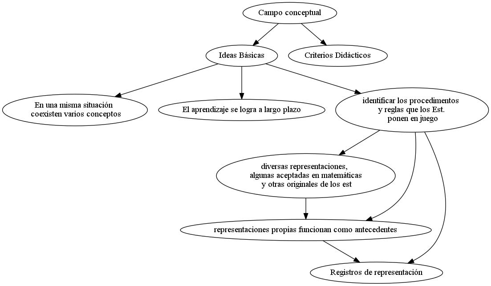
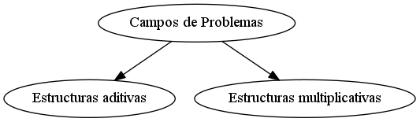

<h2>Table of Contents</h2>

<ul>
<li><a href="#sec-1">1. Perspectivas para la Enseñanza de la Matemática - Primaria</a>
<ul>
<li><a href="#sec-1-1">1.1. Clase 1: Contextos y problemas</a>
<ul>
<li><a href="#sec-1-1-1">1.1.1. TODO Tarea</a></li>
</ul>
</li>
<li><a href="#sec-1-2">1.2. Clase 2: Nuestras tradiciones de enseñanza</a>
<ul>
<li><a href="#sec-1-2-1">1.2.1. ¿Cuánto de deliberado y cuánto de espontáneo tienen nuestros modelos de enseñanza?</a></li>
<li><a href="#sec-1-2-2">1.2.2. Las marcas de los clásicos</a></li>
<li><a href="#sec-1-2-3">1.2.3. ¿Y qué efectos producen estas prácticas en la percepción que tienen los alumnos de la matemática?</a></li>
<li><a href="#sec-1-2-4">1.2.4. Las marcas de los modernos</a></li>
<li><a href="#sec-1-2-5">1.2.5. La presencia de los materiales didácticos en las aulas&#x2026;</a></li>
<li><a href="#sec-1-2-6">1.2.6. ¿Qué perspectivas surgieron después de las reacciones a la matemática moderna en las aulas?</a></li>
<li><a href="#sec-1-2-7">1.2.7. Actividad: Para pensar, registrar y guardar&#x2026;</a></li>
</ul>
</li>
<li><a href="#sec-1-3">1.3. Clase 3: Los alumnos y las formas de apropiación de los contenidos matemáticos</a>
<ul>
<li><a href="#sec-1-3-1">1.3.1. Gráficos</a></li>
<li><a href="#sec-1-3-2">1.3.2. Discusiones en clase</a></li>
<li><a href="#sec-1-3-3">1.3.3. Actividad 3:</a></li>
</ul>
</li>
<li><a href="#sec-1-4">1.4. Notas</a></li>
<li><a href="#sec-1-5">1.5. Bibliografía</a></li>
</ul>
</li>
</ul>

# Perspectivas para la Enseñanza de la Matemática - Primaria

## Clase 1: Contextos y problemas

### TODO Tarea

-   Elegir una imagen entre las que no se abordaron en el desarrollo de esta clase que remita a un contexto intramatemático o uno extramatemático.
-   Realizar un breve análisis considerando:
    -   En el caso extramatemático: si ¿la situación resulta verosímil? ¿el contexto permite evaluar la razonabilidad de la respuesta obtenida? ¿Por  qué?
    -   En el caso intramatemático: ¿cuál es el conocimiento matemático en estudio? ¿A qué conclusiones piensa que se quiere llegar?

## Clase 2: Nuestras tradiciones de enseñanza

### ¿Cuánto de deliberado y cuánto de espontáneo tienen nuestros modelos de enseñanza?

:: Modelo epistemológico: manera particular de interpretar las matemáticas
::  Modelo Didáctico: Una conceptualización concreta de lo que se entiende por 'enseñar y aprender' en un momento histórico, en cada tradición cultural y en cada institución.

::  Modelos didácticos espontaneso: No presentan ningún tipo de justificación explícita, mas allá de criterios genéricos emanados del sentido común.

:: Modelos didácticos deliberados: Se plantean a base de criterios manifiestos y potencialmente criticables, con principios que los fundamentan y explicitan.
-   Decisiones de enseñanza sujetas a proyectos educativos, reguladas por el proyecto social-político de enseñanza de las jurisdicciones
-   Los avances didácticos responde a conocimientos que surgen en distintos momentos.
-   Cada aporte tiene un cierto valor, pero ese valor no es absoluto, sino relativo a un proyecto y a condiciones de enseñanza. Y los proyectos y las condiciones cambian.

### Las marcas de los clásicos

-   Actividades centradas en la aplicación de técnicas:
    -   resolución de tareas aisladas,
    -   sin toma de decisiones
    -   sin necesidad de controlar el resultados de lo que se hace o
    -   sin justificar la técnica que utiliza.
-   la enseñanza de las operaciones se centraba en el trabajo sobre los algoritmos, naturalizando su aplicación posterior a la resolución de problemas.
-   Reducción de un contenido matemático a sus supuestas formas elementales, referidas a situaciones del mundo real, o más bien, el *mundo escolar*
-   En el caso de la **geometría**:
    -   Presentación iniciada por el punto, recta, plano. Para luego pasar a ángulos, figuras planas y sus medidas; los cuerpos y las medidas
    -   Sugerencias relacionadas con el trabajo manual para "Hacer concreto lo abstracto"
    -   Criterio " De lo fácil a lo difícil" respetando la estructura axiomática
    -   Comprender los conocimientos matemáticos a partir de una explicación y la representación de algunos ejemplos, le exige "saltar" el proceso de construcción progresiva que a la comunidad matemática le llevó siglos.
    -   Comprender los resultados sin haber realizado el proceso y sin saber versiones intermedias de ese conocimiento que se presenta acabado y perfecto.

### ¿Y qué efectos producen estas prácticas en la percepción que tienen los alumnos de la matemática?

-   Se induce al alumnos a pensar que la matemática es:
    -   general,
    -   abstracta
    -   difícil por naturaleza,
    -   y sin vinculación con los sujetos.

### Las marcas de los modernos

-   Fueron dos loas vías por las que se buscó cambiar la forma de enseñanza de la matemática en la escuela:
    -   Nuevos contenidos
    -   Aprendizaje por descubrimiento
-   ¿Cuál era el sentido de cambiar modelos concretos por ideas abstractas?
    -   Se buscaba que a través de la noción de conjunto, y sus operaciones, el niño desarrollara su capacidad para establecer relaciones y pudiera resolver distintas situaciones..
    -   En nivel inicial se propuso trabajar con clasificaciones y seriaciones antes de pasar a la idea de número
    -   El estudio de conjuntos resulta valioso por:
        -   pone en evidencia los fundamentos lógicos de la matemática
        -   promueve el enlace en espiral de los elementos de la matemática y facilita la visualización de las relaciones para el planteamiento de nuevos problemas.
        -   Se proyecta a todas las materias y a todos los ámbitos.

### La presencia de los materiales didácticos en las aulas&#x2026;

-   Con el propósito de ir de lo concreto a lo abstracto, de la manipulación a la representación, surgieron las *varillas* y los *geoplanos*.
-   También surgieron materiales para apoyar el sistema de numeración y el cálculo, como el *material multibase* o el uso de *regletas*
-   Se produce un corrimiento al objeto ya que lo que se enseña y aprende es a usar el material y -de no mediar otras acciones- los alumnos no pueden resolver sin él.

### ¿Qué perspectivas surgieron después de las reacciones a la matemática moderna en las aulas?

### Actividad: Para pensar, registrar y guardar&#x2026;

-   Registren sus primeras impresiones sobre las marcas de los clásicos y los modernos en su propia historia escolar y profesional. Guarden estas notas, podrán ser de mucha utilidad en el momento de elaboración del trabajo final. Estas notas no deben enviarlas al tutor, es un insumo personal de trabajo.

En mi caso no es tanto la marca personal de los clásicos o modernos lo que me suscita la clase, sino la ruptura que viví al atravesar un cambio de escuela entre 4to grado y 5to grado. Fue una etapa dura de mi vida, en cuarto grado vivía con mi papá (separado desde los 6 años) desde hacía 2 años y se separa por segunda vez con lo que vuelvo a vivir con mi mamá. En medio de estos cambios mi rebeldía se manifestaba en la escuela, en particular con una maestra nueva (otro cambio) que si bien no era joven, presentaba nuevos modos de enseñar y yo fui muy cruel con ella. 
No puedo recordar claramente cómo enseñaba, pero si se que cuando pasé a 5to, en una nueva escuela, todo cambió. Tuve serios problemas para pasar de grado principalmente porque no podía entender el algoritmo de la división. Sabía, podía dividir, resolvía problemas, pero no entendía de donde salían los número. En esta escuela la división se abordaba de forma más mecanizada por el algoritmo y la resta producto de la multiplicación entre el cociente y el divisor la obviaban, osea, ponían el resultado directo. Esto me mareaba y no fue hasta que lo mecanicé que atravesé ese grado. 
Muchos años después, en el profesorado, en las primeras clases de matemática un deja vu o un claro momento de insight en el cual como rayo atravesando el cielo comprendí que la señorita de 4to me enseñaba usando el enfoque de didáctica de la matemática que estaba en ese preciso momento aprendiendo. Que fue ella quien se dedicó a intentar que piense las matemáticas y no que las reproduzca. Y yo lo único que recuerdo haberle devuelto fueron malos tratos, burlas e improperios. Ahora me encuentro en este lado de la vida donde intento aprender a enseñar como ella me enseñó a mi. 

## Clase 3: Los alumnos y las formas de apropiación de los contenidos matemáticos

-   Es clave entender la **forma de aprender** para pensar como orientar la enseñanza
-   Aportes teóricos sobre **la forma de aprender**:
    -   Fundamentos Piagetianos para la construcción del pensamiento conceptual:
        -   Gerard Vergnaud y la teoría de los campos conceptuales
        -   Raymond Duval
        -   Michele Artigue
        -   Colette laborde
    -   El aprendizaje por resolución de problemas:
        -   ¿A través de qué tipo de situaciones adquieren significado los conceptos y procedimientos matemáticos?
        -   ¿Cuáles serían las condiciones que deben reunir tales situaciones para propiciar la apropiación del saber por quien aprende?
        -   La actividad de aprender es una *acción en situación*.
            -   *acción en situación* como la que se desarrolla en ocasión de *resolver un problema*
            -   Base o criterio del pensamiento conceptual:
            
            :: Una práctica lograda por entrenamiento o acondicionamiento no es un concepto, pero un concepto que no sea operativo tampoco lo es. (Vergnaud 1997)
            
            -   Esto es un hacer en que se puedan dar explicaciones teóricas y unas nociones teóricas que puedan ser utilizadas cuando sea necesario.
            
            :: [estas situaciones son aquellas] para las que el sujeto no dispone de todas las competencias necesarias, lo que lo obliga a un tiempo de reflexión y de exploración, a dudas, a tentativas abortadas; y lo conduce eventualmente al triunfo, y eventualmente al fracaso” - (Vergnaud, 1991: 135-136)
            
            :: Consideramos que cada actividad constituye un problema matemático para un alumno en la medida en que involucra un enigma, un desafío a sus conocimientos matemático, es decir, si estos le permiten inicar la resolución del problema y para hacerlo, elabora un cierto procedimiento y pone en juego las nociones que tiene disponibles, modificándolas y estabñeciendo nuevas relaciones. (cuaderno para el aula 3, pag. 20, MEN, 2006)
    -   ¿Qué más sobre la resolución?
        -   Procesos interpersonales que luego devienen procesos intrapersonales
        -   Modalidades de procesos interpersonales
            -   Con o sin dimensión social del problema: Implica que haya o no una comunicación efectiva entre las partes para la resolución del problema.
        -   Las interacciones durante el debate implican, para cada niño, volver a pensar en las relaciones que estableció entre los elementos del problema y explicitarlas, reconocerlas.
    -   ¿Cómo elegimos los problemas?
        
        :: Campo Conceptual: Interconexión entre los conceptos matemáticos como la evolución psicogenética. "Un campo conceptual es un espacio de problemas o de situaciones-problemas cuyo tratamiento implica conceptos y procedimientos de varios tipos en estrecha conexión. La noción de campo conceptual permite estudiar de manera más integrada el desarrollo simultáneo y coordinado de los diferentes conceptos necesarios para la compresión de un conjunto organizado de clases de problemas, de los procedimientos que permiten tratarlos y de los sistemas simbólicos que permiten representarlos.
    -   El niño, la matemática y la realidad (1991)
    
    :: "Por un lado, la aprehensión de los objetos matemáticos no puede ser otra cosa que una aprehensión conceptual y por otro, solamente por medio de la producción de representaciones semióticas es posible realizar una actividad sobre los objetos matemáticos" (Raymond Duval, 1995)

### Gráficos

### Discusiones en clase

-   Los momentosde discusión involucran mucho más que una simpleexplicitación frente a toda la clase de las producciones individuales. Su valor central reside en que son potencialmente fructíferos para la generación de confrontaciones, reflexiones y argumentaciones
-   la actividad debe proponer un verdadero problema por resolver, debe permitir utilizar los conocimientos anteriores y, al mismo tiempo, ofrecer una resistencia suficiente para llevar al alumno a hacer evolucionar esos conocimientos anteriores, a cuestionarlos, a conocer sus límites, a elaborar nuevos.
-   El aprendizaje matemático, como ya mencionamos, se basa en la *resolución de problemas* y la *reflexión acerca de lo realizado*.
-   limitaciones tales como que alguno de los alumnos del grupo asuma "la dirección de la solución" o o que algún participante, sin esgrimir argumentos del orden matemático, esté sistemáticamente en desacuerdo con las propuestas de los otros.
-   teoría de las situaciones didácticas elaborada por Guy Brousseau (1986, 1994), que propone asociar los conocimientos matemáticos a distintos tipos de situaciones susceptibles de hacer funcionar diferentes dinámicas sociales.
    -   se denominan situaciones a-didácticas: problemas a los cuales son confrontados los alumnos y la organización de estas situaciones permite la evolución de sus conocimientos matemáticos.
    -   desaparece de ellas -momentánea y aparentemente- la intencionalidad didáctica. Es el alumno, y no el maestro, quien pone en escena al conocimiento en función de los requerimientos de la situación.
    -   clases de situaciones a-didácticas ligadas a los diferentes niveles de sentido de los conocimientos:
        -   de acción, de formulación y de validación,
-   *son finalidades de tipo social las que permiten el pasaje de una fase de acción a una fase de formulación y de esta última a una fase de validación. La puesta en acción de una finalidad de tipo social es el instrumento utilizado aquí para modificar la significación de los conocimientos en los alumnos.*
-   Para que los efectos de estas interacciones sean benéficos, las participaciones de los alumnos deben cumplir con ciertas características, tales como que comprometan sus propias convicciones, expliciten sus puntos de vista acerca del problema considerado, ofrezcan explicaciones de los procedimientos realizados, utilicen un lenguaje comprensible, esgriman argumentaciones de orden matemático y no simplemente opiniones.
-   Caso de tercero: *Una panadería fabrica 180 tortas por día y las entrega a cada una de sus 15 sucursales de modo que todas reciban la misma cantidad de tortas. ¿Cuántas tortas llegan a cada sucursal?*
    -   La comparación no se centró, en este caso, tanto en la economía y fiabilidad de los procedimientos sino en poder interpretar un procedimiento en términos del otro.
    -   Otra intervención de la docente consiste en ofrecer la escritura aritmética de lo que dicen los alumnos, para ofrecer herramientas que colaboren en la objetivación de los conocimientos. Por último, cierra con una conclusión sobre los aspectos principales que fueron discutidos y que considera necesario que los alumnos reconozcan como conocimientos a los que se les otorga un status oficial y que podrán -y deberán- ser reutilizados en las situaciones donde sean pertinentes.
-   Sobre los *debates matemáticos*:
    -   Al respecto, Balacheff (1982) distingue entre explicaciones, pruebas y demostraciones. Una explicación es todo discurso que apunta a comunicar el carácter de verdad de un enunciado matemático. Una prueba es una explicación aceptada por otros en un momento dado. Por ello, una explicación puede constituir una prueba para un grupo mientras que no lo es para otro. Finalmente, las demostraciones son pruebas aceptadas por toda la comunidad de matemáticos, donde los enunciados se deducen siguiendo ciertas reglas a partir de unos pocos enunciados considerados verdaderos y, además, se refieren a objetos teóricos.

### Actividad 3:

Intervenir en el foro de su grupo compartiendo el valor que Uds. otorgan al momento de debate de la clase y los desafíos que su gestión conlleva.

Desde mi 

## Notas

:: En Argentina, en la ciudad de San Carlos de Bariloche, funciona el Grupo Patagónico de Didáctica de la Matemática, con la coordinación de la Dra. Betina Zolkower y la Prof. Ana Bressan. Este grupo está constituido por profesionales de la educación dedicados a estudiar, investigar y difundir el enfoque de la Educación Matemática Realista. En su sitio se pueden encontrar experiencias de aula en ese marco, publicaciones específicas y numerosos links de interés. <http://www.gpdmatematica.org.ar/>
:: Para conocer más sobre la Red Latinoamericana de Etnomatemática ver <http://www.etnomatematica.org>

## Bibliografía

-   Agrasar, M; Crippa, A; Chara, S; y Chemello, G. Ciclo de formación en enseñanza de la Matemática en el Nivel Primario. Dirección de gestión educativa. Ministerio de Educación de la Nación, 2010
-   Ávila, A. (2011), “En matemáticas&#x2026; ¿qué nos dejaron las reformas de fin del siglo XX?”, en Cuadernos de Investigación y Formación en Educación Matemática, Año 6, Nº 9, pp 39-50. Costa Rica.
-   Bressan, A., B. Bogisic y K. Crego, Razones para enseñar Geometría en la Educación Básica, Buenos Aires, Ediciones Novedades Educativas, 2000.
-   Bosch, M. y Gascón, J. “Fundamentación antropológica de las organizaciones didácticas: de los ´talleres de prácticas matemáticas´ a los ´recorridos de estudio e investigación´, en Diffuser les mathématiques (et les autressavoirs) commeoutils de connaissance et d’action (pp. 49-85), A. Bronner, M. Larguier, M. Artaud, M. Bosch, Y. Chevallard, G. Cirade& C. Ladage (Eds.), Montpellier, Francia: IUFM de l’Académie de Montpellier, 2010. <http://www.atd-tad.org/wp-content/uploads/2012/05/mariannaJosep-CITAD-II-2010.pdf>
-   Combetta, O. C, Planeamiento curricular, Buenos Aires, Losada, 1969.
-   Combetta,  O. (1969). Didáctica especial en la educación moderna, Buenos Aires, Losada.
-   Freire, P.,  U. D’Ambrosio,  M. Mendonca, “A conversation with Paulo Freire”, For the learning of Mathematics,1997.
-   Imperatore, A., Lecciones de Didáctica General y Especial de los ramos instrumentales, Buenos Aires, Librería del Colegio, 1941.
-   Kline, M., El fracaso de la Matemática Moderna ¿Por qué Juanito no sabe sumar? Siglo XXI Madrid,  1976
-   Pensar la dictadura: terrorismo de Estado en Argentina: preguntas, respuestas y propuestas para su enseñanza, Ministerio de Educación de la Nación, Buenos Aires, 2010. <http://www.educ.ar/sitios/educar/recursos/ver?id=91374>
-   Ziperovich, R., Enseñanza moderna de Matemática, Rosario, Biblioteca, 1969.

<h2 class="footnotes">Footnotes: </h2>

<a id="fn.1" class="footnum" href="#fnr.1">1</a> Acá está el conflicto entre el enfoque y el disciplinamiento del tiempo escolar. El tiempo de reflexión y de exploración no es homogéneo pero el tiempo de los resultados es estricto y se aplica a todos los casos. Eso sólo puede llevar a fracasar la aplicación de este enfoque, dado que si no se modifica el tiempo escolar, no se da lugar a que todxs puedan desarrollar el pensamiento conceptual tal como Vergnaud lo plantea. Es la crónica de otro fracaso anunciado por el enquistamiento del sistema educativo burocrático

<a id="fn.2" class="footnum" href="#fnr.2">2</a> no necesariamente, es importante tomar en cuenta otras variables para determinar si realmente hay un debate: ¿Cuántos alumnos son? ¿quiénes participan del debate? ¿cómo? ¿basta con abrir la instancia para que este ocurra? Pareciera que una condición sin equa non para que estas interacciones se lleven a cabo como describe la autora es que lo alumnos estén involucrados en su proceso de aprendizaje. Y este ivolucramiento no es dependiente del enfoque, o mejor dicho no es el enfoque lo que lo determina, sino una multitud de factores, de las cuales el enfoque se tan solo uno de ellos.

